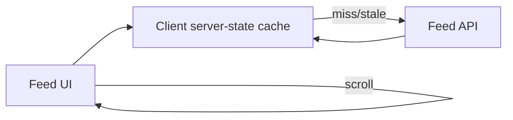
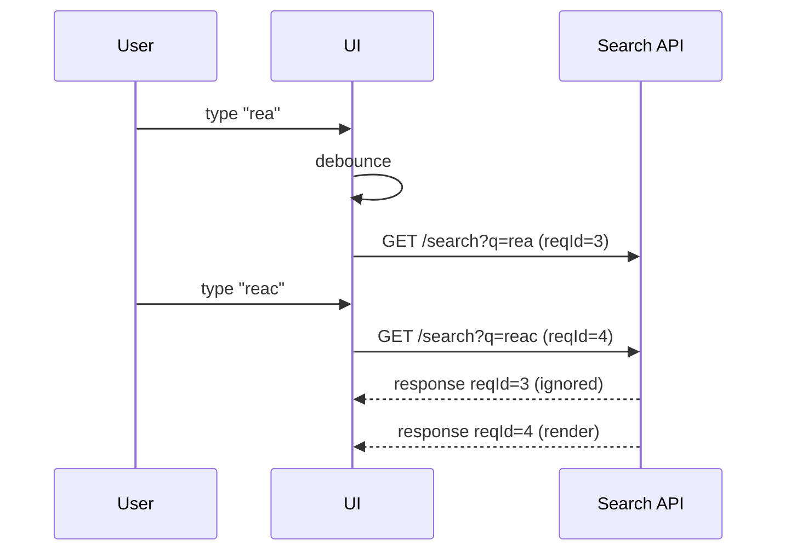
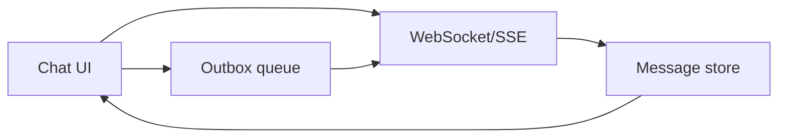

# Front-End System Design — Scalable UI systems & Data fetching strategies

Front-end system design interviews test how you think about building UIs that scale across **users**, **features**, **teams**, and **time**—with real constraints like performance, accessibility, reliability, and developer experience.

## How to use this file

- Treat each question as a **flashcard**: answer out loud first, then compare.
- Always state **assumptions** (traffic, devices, latency, SEO needs, auth model).
- Prefer answers that include **trade-offs** and **failure modes**.

---

## Designing scalable UI systems

### 1) What does “scalable UI system” mean?

**Short answer**: A UI system is scalable when it can grow in features and complexity while staying **consistent**, **performant**, **accessible**, and **maintainable**—without making every change risky or slow.

---

### 2) What are the first questions you ask in a front-end system design interview?

**Short answer**:
- Who are the users and what are the core use cases?
- What are the most important screens and user journeys?
- What constraints exist? (SEO, offline, real-time, accessibility, device mix, internationalization)
- What’s the data shape and how fresh must it be?
- What performance goals matter? (LCP/CLS/INP, time-to-interactive, bundle size)

---

### 3) How do you break down the UI into components and modules?

**Short answer**:
- Identify page-level containers (routes) vs reusable components.
- Separate **presentation** from **data orchestration** (hooks/services).
- Create stable primitives via a design system (Button/Input/Modal).

**Rule of thumb**: “Co-locate what changes together; separate what changes for different reasons.”

---

### 4) What are key cross-cutting concerns you should address early?

**Short answer**:
- **Accessibility** (keyboard support, semantics, focus management)
- **Performance** (rendering cost, lists/virtualization, code splitting)
- **Observability** (logging, metrics, tracing, error reporting)
- **Security** (auth/session, XSS/CSRF considerations)
- **Internationalization** (formatting, layout expansion, RTL if needed)

---

### 5) What are common failure modes of “unscalable” UI systems?

**Short answer**:
- Inconsistent component behavior and styling across features
- “God components” that mix data fetching, state, presentation, and side effects
- No boundaries: arbitrary cross-feature imports and duplicated logic
- Global state used for everything
- Performance regressions from unbounded renders/lists and heavy bundles

---

## Data fetching strategies

### 1) What are the main goals of a data fetching strategy?

**Short answer**: Deliver correct data with good UX by handling **loading**, **errors**, **caching**, **staleness**, **pagination**, and **mutations**—while keeping the app responsive and consistent.

---

### 2) CSR vs SSR vs SSG: how does rendering strategy affect data fetching?

**Short answer**:
- **CSR**: fetch in the browser after load (simpler; can hurt first content for SEO/LCP).
- **SSR**: fetch on the server for initial HTML (better first paint/SEO; more complexity).
- **SSG**: fetch at build time (fastest at runtime; less fresh).

**Interview framing**: “Choose based on freshness needs, SEO, and performance goals.”

---

### 3) What is “server state” and why is it different from “client state”?

**Short answer**:
- **Server state** is remote data with caching, invalidation, retries, and freshness concerns.
- **Client state** is local UI/app state (tabs, modals, filters, optimistic UI flags).

**Guidance**: Treat server state as a cache with policies; don’t store it in a generic global store unless needed.

---

### 4) What caching strategies do you consider?

**Short answer**:
- Cache per query key (params matter)
- Define staleness (how long before refetch)
- Background revalidation (stale-while-revalidate UX)
- Deduplicate in-flight requests
- Invalidate/refetch after mutations

---

### 5) How do you design loading and error states for good UX?

**Short answer**:
- Use skeletons/placeholders for primary content, not spinners everywhere.
- Distinguish initial load vs refresh vs pagination loads.
- Provide retries and actionable error messages.
- Don’t block the whole page when only one panel failed.

---

### 6) Pagination vs infinite scroll: trade-offs?

**Short answer**:
- Pagination: predictable, easy to navigate, better for SEO and memory.
- Infinite scroll: smoother browsing; harder for deep linking, back/forward, and footer access.

**Hybrid pattern**: infinite scroll with a “Load more” button and URL state for position.

---

### 7) How do you handle mutations (create/update/delete) safely?

**Short answer**:
- Optimistic UI when it improves UX (with rollback on failure).
- Invalidate/refetch or update cache in place after success.
- Handle conflicts (server is source of truth).

---

### 8) Real-time data: polling vs SSE vs WebSockets?

**Short answer**:
- Polling: simplest, more overhead/latency.
- SSE: server → client streams (great for updates).
- WebSockets: bi-directional real-time (chat/collab).

---

## Caching & state synchronization

### 1) What does “state synchronization” mean in front-end apps?

**Short answer**: Keeping the UI consistent with the server (and with itself) as data changes due to **user actions**, **background refetches**, **real-time events**, **multiple tabs**, and **concurrent requests**.

---

### 2) What are common sources of “out of sync” bugs?

**Short answer**:
- Duplicate sources of truth (same data stored in multiple places)
- Mutation races (A and B requests return out of order)
- Stale caches (no invalidation or wrong cache key)
- Cross-tab changes (user logs out in one tab, others stay “logged in”)
- Real-time updates that don’t reconcile with local state (double-inserts, flicker)

---

### 3) Cache keys: what should be part of a query key?

**Short answer**: Anything that changes the server result:
- route params, filters, sorting, pagination cursor/page
- auth/tenant scope (if it changes the dataset)
- locale/timezone when it affects formatting/content

**Pitfall**: Forgetting a parameter in the key leads to showing “wrong” cached data.

---

### 4) Invalidation vs update-in-place: what’s the trade-off after mutations?

**Short answer**:
- **Invalidate + refetch**: simpler and correct, but can be slower and cause UI “jumpiness”.
- **Update in place**: faster and smoother, but harder (must maintain consistency across lists/details).

**Good default**: invalidate for correctness; optimize with in-place updates for high-traffic interactions once measured.

---

### 5) Optimistic updates: when are they worth it and how do you keep them safe?

**Short answer**: Worth it when latency would otherwise harm UX (like/unlike, toggle, reorder). Keep them safe by:
- Having a rollback plan on error
- Using stable ids (temporary client ids mapped to server ids)
- Preventing duplicate events when server pushes updates back

---

### 6) How do you handle out-of-order responses (race conditions)?

**Short answer**:
- Track request ids / timestamps and ignore stale responses
- Cancel in-flight requests when superseded (where possible)
- Make writes idempotent (server-side) and reconcile on success

**Interview-friendly example**: “Search-as-you-type: ignore results from older queries.”

---

### 7) How do you keep multiple views consistent (list ↔ detail ↔ counts)?

**Short answer**:
- Normalize shared entities (single source of truth) or use a shared cache keyed by entity id
- On mutation, update the entity once and let all views derive from it
- Avoid copying server entities into many local component states

---

### 8) Cross-tab synchronization: what do you do for auth/session changes?

**Short answer**:
- Use a shared source (cookie-based session) plus a signal for tab coordination.
- Listen for `storage` events (when using storage) or use `BroadcastChannel` to notify other tabs about logout/login changes.

**Goal**: prevent “one tab logged out, one tab still acts logged in”.

---

## Real-time features

### 1) What counts as a “real-time” feature?

**Short answer**: Any UX where the UI updates continuously or near-instantly as events happen (chat, notifications, collaborative editing, live dashboards, presence, order status updates).

---

### 2) Polling vs SSE vs WebSockets: how do you choose?

**Short answer**:
- **Polling**: simplest; higher latency/overhead; good for low-frequency updates.
- **SSE**: server → client stream; great for feeds/notifications; simpler than WebSockets.
- **WebSockets**: bi-directional; best for interactive real-time (chat, collaboration, multiplayer).

**Rule of thumb**: “If I only need server→client updates, I consider SSE; if I need bi-directional, WebSockets.”

---

### 3) What are the main challenges in real-time UI?

**Short answer**:
- Ordering and duplication (events arrive twice or out of order)
- Catch-up (client reconnects and missed events)
- Reconciliation with local optimistic updates (avoid flicker/double apply)
- Backpressure and performance (event bursts)
- Offline/poor network handling (reconnect strategy)

---

### 4) How do you design an event protocol for real-time updates?

**Short answer**:
- Use a message envelope with `type`, `payload`, and metadata like `id`, `timestamp`, `sequence`.
- Make events idempotent (re-applying doesn’t corrupt state).
- Provide a way to **resubscribe** and **catch up** (last sequence/event id).

---

### 5) How do you handle reconnects reliably?

**Short answer**: Use **exponential backoff + jitter**, detect stale connections via heartbeats/pings, and on reconnect:
- re-authenticate if needed
- resubscribe to channels
- request missed events since the last seen sequence id

---

### 6) How do you keep real-time updates from harming performance?

**Short answer**:
- Batch state updates (coalesce events into a single render tick)
- Virtualize large lists and avoid re-rendering the entire page on each event
- Apply backpressure (drop/merge low-value events, sample, or throttle UI updates)
- Prefer derived views over copying data into many local states

---

### 7) How do you test real-time features?

**Short answer**:
- Unit test reducer/state reconciliation logic (idempotency, ordering)
- Integration test UI updates with a mocked event stream
- E2E test a critical path in a stable environment (avoid flakiness by controlling event timing)

---

## Performance trade-offs

### 1) What does “performance trade-off” mean in front-end system design?

**Short answer**: Choosing between competing goals—speed, cost, complexity, correctness, and UX. Most performance work is about moving cost between **time** (latency), **work** (CPU), **bytes** (network), and **complexity** (engineering/ops).

---

### 2) SSR vs CSR vs SSG: what are the performance trade-offs?

**Short answer**:
- **SSR**: better first content/SEO, but more server cost and complexity; can still ship lots of JS and be slow to become interactive.
- **SSG**: fastest delivery and cacheability, but less fresh; needs revalidation strategy.
- **CSR**: simplest server, but can delay meaningful content and increase reliance on JS execution.

**Interview framing**: “Optimize for the user’s first meaningful experience, not just where rendering happens.”

---

### 3) More caching vs fresher data: how do you decide?

**Short answer**:
- Cache more for speed and resilience (faster repeat loads, lower server load).
- Fetch fresher for correctness and trust (real-time dashboards, financial data).

**Practical pattern**: stale-while-revalidate—show cached immediately, refresh in background, and clearly communicate freshness when it matters.

---

### 4) Pagination vs infinite scroll: what’s the performance angle?

**Short answer**:
- Infinite scroll can create memory and rendering pressure (long lists).
- Pagination limits DOM size and is easier to virtualize and deep-link.

**Mitigation**: virtualization + “load more” patterns; keep URL state for position when useful.

---

### 5) Real-time updates vs battery/CPU/network: what are the trade-offs?

**Short answer**:
- Real-time can increase network chatter and render frequency.
- Frequent renders can harm INP and battery on mobile.

**Mitigation**:
- Batch updates, throttle low-value events, and use backpressure.
- Prefer SSE over WS when you only need server→client updates.

---

### 6) Optimistic UI vs correctness: when can it backfire?

**Short answer**: Optimistic UI improves perceived latency, but can create reconciliation complexity (rollbacks, conflicts, duplicates). It’s best for low-risk actions with clear rollback UX.

---

### 7) Client performance vs developer velocity: what architectural choices matter?

**Short answer**:
- Heavy frameworks/libraries can slow load and runtime but increase dev speed.
- Abstractions can reduce bugs but add overhead.

**Interview-friendly line**: “I pick the simplest approach that meets goals, then measure. I don’t optimize blindly.”

---

## Scalability (escalabilidade)

### 1) “Escalabilidade” em front-end significa escalar o quê?

**Short answer**: Escalar **usuários**, **dados**, **features**, **times** e **mudanças** (deploys). Um sistema escalável continua previsível e rápido conforme o produto cresce.

**Common dimensions**:
- **User scale**: mais tráfego, dispositivos mais lentos, piores redes.
- **Data scale**: listas enormes, busca, paginação, caches.
- **Feature/team scale**: mais squads contribuindo sem quebrar padrões.
- **Change scale**: releases frequentes com rollback seguro e observabilidade.

---

### 2) Quais são os sinais de que um front-end não escala bem?

**Short answer**:
- Bundles grandes e lentos para qualquer página
- Re-renders amplos (estado global para tudo)
- Sem limites de lista (sem paginação/virtualização)
- Contratos de API inconsistentes (erros/paginação “case a case”)
- Sem guardrails (lint/boundaries), “shared” vira dumping ground
- Incidentes recorrentes sem prevenção (sem SLOs, sem rollout seguro)

---

### 3) Estratégias práticas para escalar performance (usuários e dados)

**Short answer**:
- **Code splitting** por rota/feature + controle de third-parties
- **Virtualização** para listas grandes
- **Cache** (HTTP + cache de server state) com keys corretas e invalidação clara
- **Offload** de CPU para workers quando necessário
- Metas e budgets (INP/LCP/CLS) + monitoramento (RUM)

---

### 4) Estratégias para escalar times (arquitetura e governança)

**Short answer**:
- Estrutura **feature-based** + boundaries explícitas (import rules)
- Design system + tokens (consistência e velocidade)
- APIs internas claras (barrels com parcimônia; módulos com contrato)
- Docs curtas: “como fazer X aqui” + exemplos
- CI com qualidade mínima (lint, typecheck, testes críticos)

---

### 5) Como escalar mudanças com segurança (rollouts)

**Short answer**:
- Feature flags com expiração
- Canary/gradual ramp + rollback criteria
- Observabilidade: erros, INP/LCP/CLS, funis críticos
- Migrações em fases (compatibilidade para trás)

---

## Architecture boundaries & migrations (advanced)

### 1) Boundaries enforcement: como impedir “spaghetti imports”?

**Short answer**:
- Defina módulos/áreas (ex: `features/*`, `shared/*`, `app/*`) e regras do que pode importar o quê.
- Faça isso ser **enforçado** via lint/CI (não só “convenção”).

**Exemplos de guardrails**:
- ESLint rules para restringir caminhos de import
- “Public API” por pasta (exports explícitos) em vez de importar arquivos internos
- Codeowners/reviews obrigatórios para `shared/` e infra

---

### 2) Dependency inversion: o que significa no front-end?

**Short answer**: Componentes/features devem depender de **abstrações** estáveis, não de detalhes concretos difíceis de trocar (ex: chamar `fetch` direto em todo lugar). Você injeta dependências (cliente HTTP, storage, clock) para tornar código testável e migrável.

**Benefícios**:
- Testes mais fáceis (mock no boundary)
- Migrações mais seguras (trocar implementação por baixo)
- Menos acoplamento entre camadas

---

### 3) “Shared kernel” pattern: quando vale a pena?

**Short answer**: Um “shared kernel” é um conjunto pequeno e muito estável de tipos/contratos/primitivos compartilhados (ex: design tokens, tipos de domínio, cliente HTTP). Ele evita duplicação, mas exige governança para não virar dumping ground.

**Regra**: O kernel deve ser **pequeno**, bem versionado e com owners claros.

---

### 4) Migrações e big refactors: como fazer com segurança?

**Short answer**:
- Faça migrações em fases (compatibilidade para trás) e reduza o “blast radius”.
- Use feature flags para alternar entre caminhos antigo/novo.
- Crie métricas/alertas e rollback criteria antes do rollout.
- Prefira “strangler pattern”: envolver/substituir partes aos poucos.

**Técnicas práticas**:
- Adapter layer (nova API por trás de uma interface)
- Dual run (rodar novo caminho em shadow e comparar resultados)
- Codemods para mudanças mecânicas (imports/renames)

---

## Offline-first patterns

### 1) O que significa “offline-first”?

**Short answer**: O app deve funcionar com conectividade instável: ler dados do cache local, permitir algumas ações offline, e sincronizar depois. “Offline-first” é UX + consistência de dados.

---

### 2) Quais são os blocos principais de uma arquitetura offline-first?

**Short answer**:
- **Cache local** (IndexedDB) para dados grandes; evitar `localStorage` para isso.
- **Sync engine**: fila de mutations offline + retry/backoff.
- **Conflict resolution**: o que acontece quando servidor e cliente divergem.
- **UI states**: “offline”, “syncing”, “stale”, “failed to sync”.

---

### 3) Que estratégias de cache você menciona em entrevistas?

**Short answer**:
- Navegação: `stale-while-revalidate` para telas de lista
- Assets: cache-first via Service Worker para experiência rápida/offline
- Dados: cache por key + timestamps + invalidation

---

## Multi-region latency strategies

### 1) Quais problemas surgem em multi-region?

**Short answer**:
- Latência variável (usuários longe do data center)
- Consistência eventual (replicação entre regiões)
- “Read-your-writes” pode falhar se você lê em uma região diferente após escrever

---

### 2) Estratégias comuns para reduzir latência percebida no front-end

**Short answer**:
- CDN para assets + HTML (quando aplicável)
- Edge caching para GETs cacheáveis
- Prefetch de rotas/dados prováveis
- Otimizar “first render” (SSR/SSG quando faz sentido) + reduzir JS
- Server-state cache no cliente com stale-while-revalidate

---

### 3) Como lidar com consistência em uma UI global?

**Short answer**:
- Mostre estados (syncing/stale) quando frescor importa
- Use otimistic UI com rollback e reconciliação
- Tenha ids/versões/ETags para evitar lost updates

---

## Full prompts (feed / search / chat) + diagrams

### 1) Prompt: design a scalable activity feed

**Requirements (example)**:
- Feed paginado (infinite scroll), filtros, ordenação
- Suporte a updates em near real-time (opcional)
- Boa performance em mobile

**What to cover**:
- Paginação (cursor), dedupe, cache keys
- Virtualização, skeletons, error states
- Caching (HTTP + client cache), revalidation

**Diagram**:

---

### 2) Prompt: design search-as-you-type

**Requirements (example)**:
- Busca com autocomplete, debounce
- Cancelamento/ignorar respostas antigas
- Rate limiting e caching

**What to cover**:
- Debounce + request id
- Cache por query + TTL
- UX de loading e empty states

**Diagram**:

---

### 3) Prompt: design a chat system UI

**Requirements (example)**:
- Mensagens em tempo real
- Reconnect + catch-up
- Envio otimista

**What to cover**:
- WS/SSE choice, event protocol (id/seq)
- Offline queue para sends (opcional)
- Ordering/dedupe + reconciliation

**Diagram**:

---

## Suggested practice exercises

- Design a dashboard page with 3 panels that fetch independently; define loading/error states per panel and the retry UX.
- Design a list view with filters/sorting/pagination and decide what goes in URL state vs cache keys vs local state.
- Add optimistic updates for “like/unlike” and describe rollback behavior.
- Design a “search as you type” flow: include debouncing, cancellation/ignoring stale responses, and cache key strategy.
- Design cross-tab logout sync (choose `BroadcastChannel` or storage events) and describe failure modes.
- Design a chat system UI: message list + typing indicator + presence. Define transport (WS/SSE), event protocol (ids/sequences), reconnect/catch-up plan, and optimistic send behavior.
 - Pegue uma feature (ex: feed) e liste decisões para escalar: paginação, cache keys, virtualização, métricas (INP/LCP), rollout.
- Escolha um “big refactor” (ex: trocar cliente HTTP ou arquitetura de rotas) e desenhe um plano em fases com flags, métricas e rollback.

## Links / references

- web.dev: Data fetching patterns: https://web.dev/learn/pwa/serve-data/
- web.dev: INP: https://web.dev/articles/inp
- MDN: BroadcastChannel: https://developer.mozilla.org/en-US/docs/Web/API/BroadcastChannel
- MDN: Server-sent events: https://developer.mozilla.org/en-US/docs/Web/API/Server-sent_events
